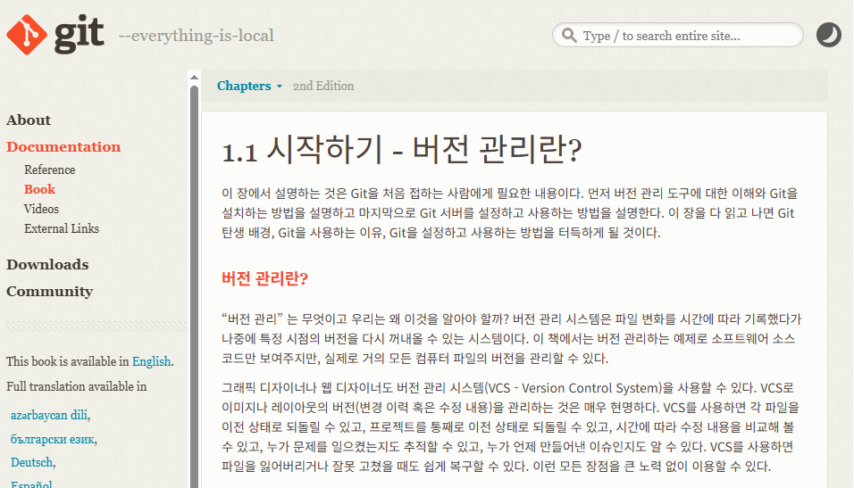
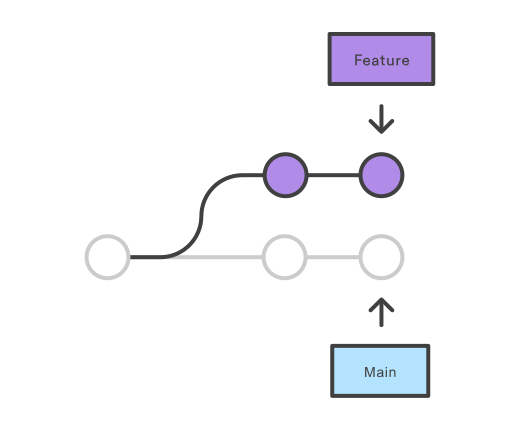

# 공부 자료

---

### git의 기본 개념과 이해

- 버전 관리란?
    
    버전 관리 시스템(VCS - Version Control System)은 파일 변화를 시간에 따라 기록했다가 나중에 특정 시점의 버전을 다시 꺼내올 수 있는 시스템이다.
    
    
    
    - 사진
        
        VCS로 이미지나 레이아웃의 버전(변경 이력 혹은 수정 내용)을 관리하는 것은 매우 현명하다. VCS를 사용하면 각 파일을 이전 상태로 되돌릴 수 있고, 프로젝트를 통째로 이전 상태로 되돌릴 수 있고, 시간에 따라 수정 내용을 비교해 볼 수 있고, 누가 문제를 일으켰는지도 추적할 수 있고, 누가 언제 만들어낸 이슈인지도 알 수 있다. VCS를 사용하면 파일을 잃어버리거나 잘못 고쳤을 때도 쉽게 복구할 수 있다.
        
- DVCS - Distributed Version Control System
    
    저장소를 히스토리와 함께 전부 복제한다. 즉, 로컬에서도 작업물을 관리(단순히 파일의 마지막 스냅샷을 Checkout하지 않음)하기 때문에 서버에 문제가 생기면 이 복제물로 다시 작업을 할 수 있다. 
    
    git은 DVCS이라는 소프트웨어이다. 
    
- github
    
    분산 버전 관리 툴인 git 저장소 호스팅을 지원하는 웹 서비스.
    
    소스 코드를 저장하는 리모트 저장소 역할을 한다.
    
    개발자들이 프로젝트를 공유하고 협업하는 플랫폼으로 개인 프로젝트 버전관리부터 협업까지 폭넓게 사용된다. 
    
- 시간관리
    
    git이 파일의 변경 시점과 변경 내용을 자동으로 기록하고 추적한다. 
    
    과거의 특정 버전을 복구하거나 협업시 발생하는 충돌을 관리할 수 있다.
    

### git의 핵심 구조

- 로컬 (push 전)
    
    
    
    - working directory - 작업 디렉토리
        
        현재 작업중인 파일들이 있는 디렉토리
        
    - staging area - 인덱스
        
        변경된 파일들 중 git이 추적하길 원하는 파일들을 일시적으로 저장하는 곳 (커밋 전)
        
    - repository - 저장소
        
        실제로 git이 관리하는 데이터가 저장되는 곳 (커밋 후) 
        
- 원격 (push 후)
    - remote - 원격 저장소
        
        인터넷 연결이 필요한 서버 저장소
        
- 흐름
    
    
    
    - tracking : 파일 버전을 관리하는 중
    - untraked : 파일 버전이 관리되지 않음

### git 명령어

- git init
    
    새로운 git 저장소를 생성할 때 사용하는 명령어.
    
    git의 구조인 working directory, staging area, local repository가 생성됨. 
    
    현재 디렉터리를 Git 리포지토리로 변환. 
    
- git clone
    
    git init과 git clone은 모두 새 git 레포지토리 초기화에 사용됨. 
    
    하지만 git clone은 git init에 종속됨.
    
    git clone은 기존 레포지토리의 복사본을 만드는데 사용됨. 
    
    즉, 내부적으로 git clone은 새 레포지토리를 만들기 위해서 git init을 먼저 호출함. 그 다음 기존 레포의 데이터를 복사하고 새 작업 파일 집합을 체크아웃함. 
    
- git add
    
    working directory → staging area로 이동.
    
    버전 관리가 되는 상태로 만들음. 
    
- git commit
    
    staging area의 내용들을 하나의 버전으로 묶어서 메시지와 함께 local repository로 이동. 
    
- git push
    
    로컬의 내용을 원격의 레포로 이동 
    
- git pull
    
    원격 저장소의 최신 내용을 로컬로 가져오는 명령어. 
    
- git branch
    
    
    
    브랜치 생성/삭제/확인 등 수행하는 명령어.
    
    브랜치는 다른 팀원들과 작업을 분리하여 새 기능 개발 같은 작업을 안전하게 할 수 있게 해줌. 
    
- git merge
    
    
    
    분기된 브랜치에서 작업 완료 후 브랜치를 합칠 때 사용하는 브랜치. 
    

### conflict

같은 파일을 수정하면 충돌이 일어나기 쉬움. 이때는 모브랜치의 최신 내용을 로컬로 받아와서 충돌을 해결 후 원격에 push해야함. 

### git convention

- feat: 새로운 기능 추가
- fix: 버그 수정
- docs : 문서 수정
- style: 코드 포맷 변경, 세미콜론 누락, 코드 변경 없음
- refactor: 리팩토링
- test: 테스트 코드 관련 작업
- chore : 패키지 매니저 환경 설정 등 코드 변경 없는 작업

---