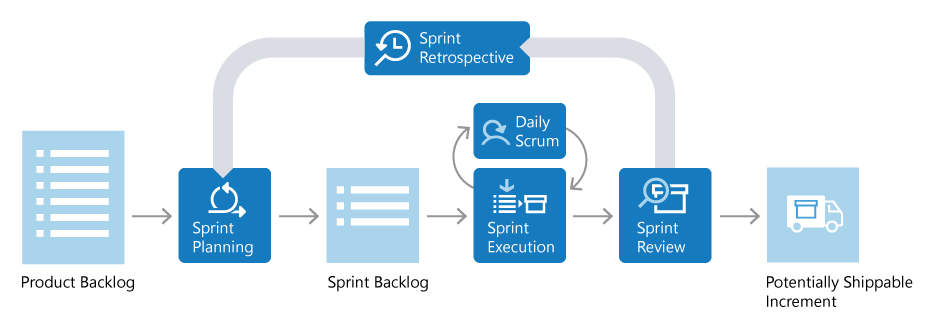

# 공부 자료 - 희정

---

# 소프트웨어 개발은 건축과 다르지 않다.

명확한 계획 없이 시작하면 도중에 요구사항이 계속 바뀌고, 예상치 못한 문제들이 발생하면서 개발 기간과 비용은 한없이 늘어나기 쉽다. 이런 혼란을 막고 효율적으로 목표를 달성하기 위해서 필요한 것이 소프트웨어 개발 방법론이다.

### 소프트웨어 개발 방법론

- 소프트웨어를 개발하기 위한 ‘구체적인 절차, 방법, 기술 등을 정리’한 것.
- 이 방법론을 통해 개발자들이 프로젝트를 효율적으로 관리하고 소프트웨어를 더욱 품질 높게 개발할 수 있도록 도와줌.

### 개발 방법론, 그게 왜 중요한가?

- 소프트웨어 개발은 복잡한 과정이며, 프로젝트의 성공을 위해서 적절한 개발 방법론을 선택하는 것이 중요함.
- 개발 방법론은 팀의 협업 방식, 일정 관리, 품질 보장 등에 직접적인 영향을 미치기 때문에, 각 방법론의 특징을 이해하고 프로젝트에 맞게 적용해야함.
- 예를 들자면, 적절한 개발 방법론을 선택하는 것은 건축 시에 알맞은 설계 방식과 도구를 고르는 것과 같음. 짓고자 하는 건물의 종류, 규모, 예산 기간에 따라 설계 방식이 달라지듯이, 소프트웨어의 특성, 팀 규모, 예산, 마감일 등에 맞춰 가장 효율적인 방법론을 선택해야 성공적인 결과를 얻을 수 있음.

### 개발 방법론 종류

- 폭포수
    - 개발 생명 주기를 폭포수가 내려오는 것처럼 순차적으로 ‘일련의 단계’로 나누어 개발하는 방법을 의미함.
    - 이전 단계의 결과물을 받아 다음 단계의 결과물을 출력하는 구조이며, 원칙적으로 완료된 이전 단계로 돌아갈 수 없음.
    - 단계 : 계획 및 분석 (discover) - 설계 (design) - 개발 (develop) - 테스트 - 운영/유지보수
- 애자일
    - 반복적이고 점진적인 개발 방법을 통해 개발을 진행하는 것이 특징.
    - 개발 초기부터 요구 사항을 반영하여 빠르게 개발하고, 그 과정에서 지속적으로 피드백을 받아 개발을 진행함.
    - 단계 : [계획 및 분석 (discover) - 설계 (design) - 개발 (develop) - 테스트단계]를 작은 단위의 사이클로 분리하고, 사이클이 종료되면 다음 사이클을 진행하는 것을 반복함.
    - 애자일 방법론의 종류
        - 칸반 (Kanban)
        - 스크럼 (Scrum)
        - 익스트림 프로그래밍 (Extreme Programming, XP)
- 린
    - 제조 산업에서 비롯된 개발 방법론으로 낭비를 최소화하고 가치를 최대화하는 것을 목적으로 함.
    - 제품을 개발하는 전 과정에서 고객의 피드백을 수시로 반영하며, 불필요한 작업을 최소화하여 생산성을 높이는 것이 목표.
    

### 폭포수 vs 애자일

|  | 폭포수 | 애자일 |
| --- | --- | --- |
| 특징 | 단계적, 순차적 진행 | 반복적, 고객 피드백 중심 |
| 프로세스 | 단계별로 엄격하게 분리된 개발 단계 | 반복적인 개발 단계 |
| 장점 | 게획 명확, 문서화 용이 | 유연성 높음, 빠른 적용 가능 |
| 단점 | 변경 대응 어려움 | 문서화 부족 가능성 |
| 적합한 프로젝트 유형 | 대규모 시스템 개발 | 스타트업, 웹/앱 개발 |

### 애자일 방법론 - 1) 칸반

- 시각적인 작업 관리 도구
- 개발 과정의 작업들이 카드 형태로 시각적으로 표시되어 작업의 진행 상황을 실시간으로 파악할 수 있는 장점
- 각각의 작업 상태(진행중, 완료, 보류 등)를 파악하는 것이 쉽기 때문에, 개발 과정에서 일어나는 문제를 빠르게 파악하여 대처 가능
- 화이트 보드에 직접 작성하거나 JIRA, Trello 등을 사용

### 애자일 방법론 - 2) 스크럼

- 프로젝트를 진행하는데 있어서 유연성과 적응성을 강조하는 방법론
- 작은 팀으로 구성된 각 팀원이 프로젝트에 참여하여 진행함.
    
    개발 주기를 일정 기가능로 나누어 각 주기마다 일정한 목표를 설정함.
    
    문제가 발생하면 팀원들끼리 빠르게 소통하여 문제를 해결함.
    
- 스크럼에서는 ‘스프린트(Sprint)’라는 주기를 사용하는데, 보통 1~4주 동안 프로젝트를 진행함.
    
    각 스프린트마다 목표를 설정하고, 해당 목표를 달성하기 위해 필요한 작업을 백로그(Backlog) 에서 우선순위에 따라 선정하여 진행함.
    
    스프린트 중에는 매일 스탠드업 미팅(Stand-up Meeting)을 진행하여 진행 상황과 문제를 공유함.
    
    스프린트가 끝나면 해당 스프린트에서 개발한 제품의 작동 여부를 검증함. 이런 과정을 반복. 
    

### 스크럼에 대해 더 알아보기

- 스크럼 과정
    
    
    
    1. Sprint Planning : 스크럼의 시작은 ‘스프린트 계획 회의(Sprint Planning Meeting)’를 통해서 스프린트 (보통 2~4주) 기간을 정함.
    2. Spring Backlog : 회의에서는 목표를 지정하고 백로그를 작성함. 이때 일정에 대한 기간은 ‘플래닝 포커’를 통해 기간을 산정함.
    3. Daily Scrum : 도출된 백로그를 기반으로 개발팀 내에서 각각 백로그에 대한 역할을 지정함.
    4. Sprint Execution : 스프린트를 진행하면서 매일 스탠딩업 미팅(Stand-up Meeting)을 통해 간략한 미팅을 진행함.
    5. Sprint Review : n차의 스프린트 기간이 종료되면 스프린트 리뷰 미팅(Sprint Review Meeting)을 통해 간략한 미팅을 진행함.
    6. Sprint Retrospective : 프로젝트가 종료될 때까지 스프린트가 진행되며, 이런 과정을 반복함. 
- 스탠딩업 미팅(Stand-up Meeting)을 하는 이유는?
    
    매일 진행되는 짧은 회의로, 팀원들 간의 진행상황과 문제를 공유하여, 문제를 빠르게 해결하고 팀원들이 서로의 일에 대해 파악을 하기 위한 목적으로 수행함. 길어지는 회의를 최소한으로 시간을 줄이기 위한 목적을 가지고 있음.
    
- 스프린트의 주기
    - 2~4주 기간이 적절함. 그러나 팀의 크기나 업무의 복잡도 및 일정에 따라 적절한 주기를 찾아야 함.
    - 개발 초기에 적절한 주기를 찾지 못 한 경우, 주기를 1주로 하여 빠른 피드백을 통해 기간을 조정할 수 있음.
- 플래닝 포커(Planning Porker)
    - 소프트웨어 개발에서 사용되는 추정 기법 중 하나.
    - 팀원들이 작업에 ‘소요될 시간을 추정’하기 위해 포커 카드를 사용함.
    - 팀원들은 각각의 작업을 보고 해당 작업의 복잡성에 가장 적합하다고 생각하는 카드를 선택함.
        
        이후, 모든 카드가 한 번에 공개되고 토론을 통해 최종 추정치를 결정함.
        
    - 이 방법은 팀원들이 서로의 생각을 나누고 각 작업에 대한 이해를 향상시키는데 도움이 됨.
    - 방법
        1. 팀원들 모두가 모여 이번 스프린트에서 수행할 작업 목록을 살펴봄.
        2. 각 작업에 대해, 팀원들은 얼마나 많은 시간과 노력이 필요한지 추정하는 포커 카드를 선택함.
        3. 팀원들은 자신이 선택한 카드를 동시에 공개함.
        4. 만약 모든 팀원들의 추정치가 비슷하다면, 그 추정치가 작업에 소요될 시간이 됨.
        5. 만약 팀원들의 추정치가 크게 다르다면, 가장 높은 추정치와 가장 낮은 추정치를 선택한 팀원들이 자신의 생각을 공유함. 이후, 모든 팀원들의 추정치가 비슷해질 때까지 카드를 선택하고 공개하는 과정을 반복함.

### 칸반 vs 스크럼

|  | 칸반 | 스크럼 |
| --- | --- | --- |
| 개발 주기 | 지속적으로 작업을 진행 | 일정한 주기마다 스프린트를 진행 |
| 업무 처리 | 작업 목록을 표현한 칸반 보드를 통해 작업을 관리.
작업 진행 상황을 체크리스트를 통해 확인. | 작업 목록을 스프린트 백로그로 관리하고, 스프린트 계획 회의, 스프린트 데일리 스크럼 등을 거쳐 스프린트를 진행. |
| 유연성 | 언제든지 변경 가능 | 스프린트 중에는 변경할 수 없음 |
| 규모 | 대형 프로젝트에 적합 | 작은 팀에 적합 |

### 어떤 개발 방법론을 선택해야 하는가

- 변화가 많다 → 애자일
- 요구사항이 명확한 대형 프로젝트다 → 폭포수

### 링크

https://www.atlassian.com/ko/agile/scrum

https://aws.amazon.com/ko/what-is/scrum/

https://www.redhat.com/ko/topics/devops/what-is-agile-methodology