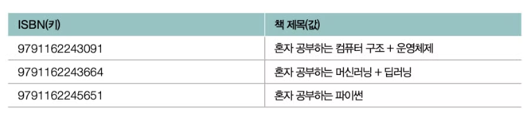
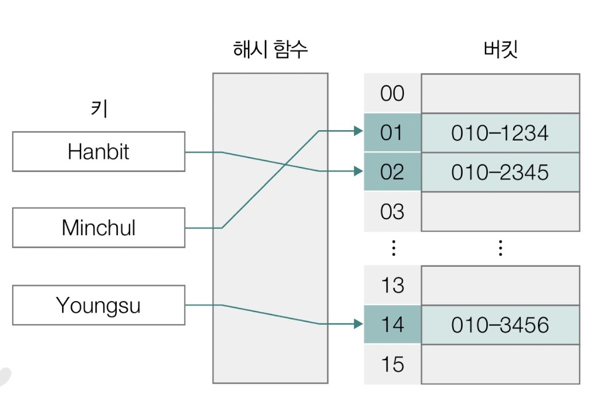
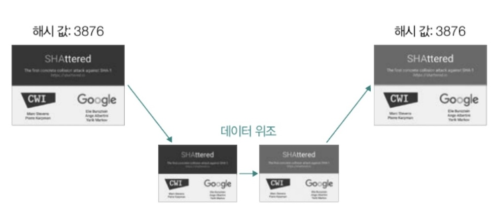
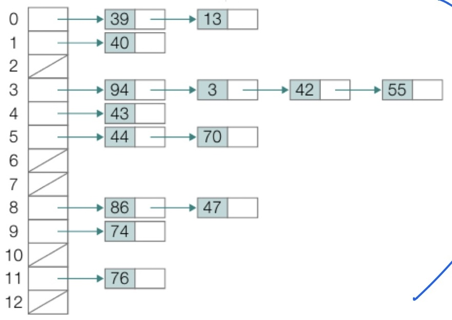

## 0. 선형 자료구조와 비선형 자료구조

- 선형 자료구조
    - 요소가 일렬로 나열되어 있는 자료 구조
    - ex. 배열, 스택
- 비선형 자료구조
    - 요소가 일렬로 나열되어 있지 않고 자료 순서나 관계가 복잡한 구조
    - ex. 트리, 그래프

- 위 선형/비선형 자료구조의 한계
    - 배열, 트리같은 자료구조의 공통적인 고민: “내가 원하는 데이터를 얼마나 빨리 찾을 수 있는가?”
    - 배열은 정렬되어 있지 않다면 처음부터 다 뒤져봐야 할 때가 많고(O(n)), 트리는 층을 타고 내려가야 함(O(logN))
    
    → 그래서 등장한 개념이 바로 '맵(Map)'
    
    - 맵은 '무엇이 어디에 있는지'를 키와 값의 쌍으로 저장하는 아주 영리한 추상적인 개념
    - 그리고 이 맵을 '가장 압도적인 속도'로 구현해낸 자료구조가 '해시 테이블’

---

## **1. 해시 테이블(hash table)이란?**

> **키(key)**와 **값(value)**의 대응으로 이루어진 표(테이블)와 같은 형태의 자료구조
> 
- 키 : 해시 테이블에 대한 입력
- 값 : 키를 통해 얻고자 하는 데이터
- 비유하자면 마치 "이름(Key)"을 알면 바로 그 사람의 "전화번호(Value)"를 찾을 수 있는 전화번호부 같은 테이블
    
    
    
    예를 들어, 위와 같이 ISBN 번호가 키라면 그에 대응하는 책 제목이 값이 된다.
    
- 검색하고자 하는 키를 입력하면 바로 데이터가 나오기 때문에 매우 직관적이라는 특징
- 실제로 어디에 사용될까?
    - 파이썬의 딕셔너리, 자바의 해시맵, 자바스크립트의 Object, 데이터베이스의 인덱싱
        
        → 현대 소프트웨어의 필수 기술
        

---

## 2. 해시 테이블의 구조와 동작



### 구조

1. **해시 함수(hash function)**
    - 키를 입력받아 정수(인덱스)를 계산하는 함수
    - 비유하자면 키를 입력받으면 정수(인덱스)로 변환해주는 마법의 상자
2. **버킷 배열(bucket array)**
    - 해시 함수가 계산한 인덱스에 따라 데이터가 저장되는 **배열**
    - 배열의 각 칸 하나를 "버킷"이라고 부름
- 키를 통해 얻고자 하는 데이터는 **버킷(bucket)**에 저장되어 있다.
- 버킷은 여러 개가 존재하며, 여러 버킷들은 배열을 형성한다.

### 동작 원리

- **해시 함수는 키를 인자로 활용하여 `버킷 배열의 인덱스`를 반환한다. 즉, 키를 해시 함수에 통과시켜 원하는 버킷에 바로 접근하는 것이다. (`O(1)`)**
- 해시 테이블에 저장된 데이터 수를 버킷의 수로 나눈 값을 **로드 팩터(load factor)**라고 한다.
    - 해시 테이블이 현재 얼마나 가득 차있는지에 대한 지표로, 로드 팩터가 클수록 해시 테이블의 성능이 떨어진다.
        - 예시
            - 버킷 수(배열 크기): 10개
            - 저장된 데이터 수: 7개
            - 계산: 7 / 10 = 0.7
                
                → 의미: "이 해시 테이블은 현재 70% 가득 찼다!”
                
            
            (보통 해시 테이블은 로드 팩터가 **0.7~0.75**를 넘어가면 배열 크기를 키우는 '리해싱'을 수행)
            
        
    - 데이터가 많아지면 해시 충돌 발생. 이 해시 충돌이 늘어나면?
        
        → 한 버킷에 여러 값이 줄줄이 연결됨(체이닝)
        
        → 검색 시간 증가
        
        → 더 이상 시간복잡도가 O(1)이 아닌 O(n)에 가까워짐
        
        → **해시 테이블 성능 저하**
        
        결론: 그래서 로드 팩터가 높으면 해시 테이블이 느려지는 것
        

---

## 3. 해시 함수

> **키(key)를 입력받아 버킷 배열의 인덱스(정수)로 변환해주는 함수**
> 

```
입력: 키 (문자열, 숫자 등 다양한 타입)
     ↓
  해시 함수
     ↓
출력: 인덱스 (0, 1, 2, 3, ... table_size-1)
```

**비유:**

- 키 = 손님 이름
- 해시 함수 = 좌석 배정 규칙
- 인덱스 = 좌석 번호

**해시 함수의 두 가지 종류**

해시 함수는 **사용 목적**에 따라 크게 두 가지로 나뉜다.

**1️⃣ 자료구조용 해시 함수** 

**목적:** 데이터를 빠르게 찾기 위해 배열 인덱스로 변환

**특징:**

- ⚡ **속도가 최우선** (매우 간단한 연산)
- 🎲 **균등 분산**이 중요 (모든 인덱스에 골고루 분배)
- 🔄 **충돌 허용** (같은 인덱스 나와도 OK → 체이닝 등으로 해결)
- 🔓 **역추적 가능해도 무방** (보안 목적 아님)

**대표적인 방법:**

**① Division Method (나눗셈 방법)**

```
h(key) = key % table_size
```

예시:

- table_size = 10
- key = 12345
- h(12345) = 12345 % 10 = 5
    
    → 인덱스 5번에 저장
    

**② Multiplication Method (곱셈 방법)**

```
h(key) = ⌊table_size × (key × A mod 1)⌋
```

(A는 0~1 사이의 상수, 보통 0.618... 사용)

**③ 문자열 해시 (간단한 예시)**

```
h(string) = (각 문자의 ASCII 값 합) % table_size
```

예시: "Bob" = (66 + 111 + 98) % 10 = 275 % 10 = 5

**2️⃣ 암호학적 해시 함수** 

**목적:** 보안, 데이터 무결성 검증

**특징:**

- 🔒 **단방향성** (해시값 → 원본 복원 불가능)
- 💥 **눈사태 효과** (입력 1비트 변경 → 출력 완전히 변경)
- 🛡️ **충돌 저항성** (같은 해시값 만들기 극도로 어려움)
- 📏 **고정 길이 출력** (SHA-256은 항상 256비트)
- 🐌 **상대적으로 느림** (복잡한 연산)
- 회원가입할 때 서버가 비밀번호를 DB에 저장하기 전에 해시로 변환해서 저장하는 데 쓰임

**대표적인 알고리즘:**

- MD5 (128비트) - 현재는 취약해서 사용 지양
- SHA-1 (160비트) - 현재는 취약해서 사용 지양
- **SHA-256** (256비트) - 현재 널리 사용
- SHA-512 (512비트)

**예시: SHA-256**

```
입력: "password"
출력: "5e884898da28047151d0e56f8dc6292773603d0d6aabbdd62a11ef721d1542d8"

입력: "passwor" (d 하나 빠짐)
출력: "3c8b3b1e91e3d5f2c9a0e4c8b7f5d3e1a2b3c4d5e6f7a8b9c0d1e2f3a4b5c6d7"
→ 완전히 다른 값!
```

**어디에 사용되나?**

- 비밀번호 저장 (원본 비밀번호 대신 해시값 저장)
- 파일 무결성 검증 (파일이 변조되었는지 확인)
- 블록체인, 디지털 서명 등

**좋은 해시 함수의 조건**

자료구조용 해시 함수가 "좋다"는 것은:

**1. 균등 분산 (Uniform Distribution)**

모든 키가 각 인덱스에 균등하게 분배되어야 함

**나쁜 예:**

```
// 모든 키가 인덱스 0으로만 감
h(key) = 0

// 짝수만 사용 (0, 2, 4, 6, 8만 사용)
h(key) = (key * 2) % 10
```

**좋은 예:**

```
// 모든 인덱스를 골고루 사용
h(key) = key % prime_number
```

**2. 빠른 계산 속도**

복잡한 연산 없이 한 번의 간단한 연산으로 계산

```
✅ 좋음: key % 10 (나눗셈 한 번)
❌ 나쁨: 복잡한 수학 함수 여러 개 사용
```

**3. 결정적 (Deterministic)**

같은 키는 항상 같은 인덱스 반환

```
h("Alice") = 3
h("Alice") = 3  // 항상 같아야 함!
```

지금까지의 정리

- 해시 테이블을 사용하는 이유
    - 빠른 검색 속도
        
        일반적인 상황에서 해시 테이블을 활용한 검색, 삽입, 삭제 연산의 시간 복잡도는 입력과 무관하게 O(1)
        
- 단점
    - 속도가 빠른 만큼 상대적으로 많은 메모리 공간 소모
    - 해시 충돌 문제 해결 필요

---

## 4. 해시 충돌

> 서로 다른 키에 대해 같은 해시 값이 대응되는 상황
> 

ex) 대표적인 해시 함수 중 하나인 SHA-1

다른 파일이어도, 두 파일 데이터에 대한 해시 값을 구해 보면 동일한 해시 값이 도출되는 경우 발생한 사례가 있었음 (구글과 CWI 암스테르담 연구소)

- 원인
    - 해시 함수는 무한한 키를 유한한 개수의 인덱스로 매핑하므로, 충돌은 필연적으로 발생
    - 키 값이 특정 패턴을 가지며, 이 패턴을 해시 함수가 충분히 분산시키지 못할 경우 일부 버킷에 키가 집중되어 충돌이 증가할 수 있음
        - 충돌 증가를 일으키는 (키 + 해시 함수) 조합
            
            ## 예시 1️⃣: 짝수 키만 들어오는 경우
            
            ### 해시 함수
            
            ```
            h(key) = key % 8
            ```
            
            ### 키
            
            ```
            2, 4, 6, 8, 10, 12
            ```
            
            ### 해시 결과
            
            ```
            2 % 8 = 2
            4 % 8 = 4
            6 % 8 = 6
            8 % 8 = 0
            10 % 8 = 2
            12 % 8 = 4
            ```
            
            ### 사용된 버킷
            
            ```
            0, 2, 4, 6
            ```
            
            👉 전체 8칸 중 **절반만 사용**
            
            👉 버킷 활용률 50%로 감소
            
            ---
            
            ## 예시 2️⃣: 문자열 해시에서 흔한 실수
            
            ### 부적절한 해시 함수
            
            ```java
            inthash(String s) {
            		return s.length() % tableSize;
            }
            ```
            
            ### 키
            
            ```
            "dog", "cat", "sun", "hat"
            ```
            
            ### 길이
            
            ```
            3, 3, 3, 3
            ```
            
            ### 결과
            
            ```
            모두 같은 버킷
            ```
            
            👉 키는 달라도 **패턴(길이)** 이 같아서 충돌
            
    - 해시 테이블의 크기를 잘못 선택하면(예: 적절한 prime(소수)가 아닌 경우) 특정 패턴의 키가 모여 충돌이 증가할 가능성이 커진다.
        - 해시 테이블의 크기는 소수인 게 좋다.
            
            **핵심 원리**
            
            가장 흔한 해시 함수 형태는:
            
            ```
            h(key) = key % tableSize
            ```
            
            이때 tableSize가 합성수면, 키의 특정 공약수 패턴이 그대로 해시 결과에 반영된다.
            
            ---
            
            **❌ 부적절한 예시: 테이블 크기 = 10 (소수 아님)**
            
            ```
            tableSize = 10
            h(key) = key % 10
            ```
            
            입력 키 (현실에서 흔함)
            
            ```
            10, 20, 30, 40, 50, 60
            ```
            
            **해시 결과**
            
            ```
            10 % 10 = 0
            20 % 10 = 0
            30 % 10 = 0
            40 % 10 = 0
            ...
            ```
            
            👉 **모든 키가 버킷 0으로 몰림**
            
            즉,
            
            - 버킷 0: 충돌 폭탄
            - 나머지 버킷 1~9: 전혀 사용 안 됨
            
            ➡️ 해시 테이블을 쓰는 의미가 사라짐 (사실상 연결 리스트)
            
            ---
            
            **✅ 좋은 예시: 테이블 크기 = 11 (소수)**
            
            ```
            tableSize = 11
            h(key) = key % 11
            ```
            
            같은 키를 넣어보면:
            
            ```
            10 % 11 = 10
            20 % 11 = 9
            30 % 11 = 8
            40 % 11 = 7
            50 % 11 = 6
            ```
            
            👉 **버킷이 고르게 분산**
            
- 해시 값은 데이터 무결성 검증에도 사용되기 때문에, 이러한 해시 충돌은 보안 상의 위험도 발생할 수 있다.

    

---

## 5. 해시 충돌 해결 방법

1. **체이닝**
    - 충돌이 발생한 데이터를 연결 리스트로 추가하는 방법
    - 하나의 테이블 인덱스에 여러 데이터가 연결 리스트의 노드로서 존재할 수 있게 됨.
        
        
        
    - 충돌이 발생할 때마다 연결 리스트의 노드를 추가하는 건 빠른 속도 보장 X → 해시 테이블의 장점 살리지 못함

2. **개방 주소법**
    - 충돌이 발생한 버킷의 인덱스가 아닌 다른 인덱스에 데이터를 저장하는 방법
    - 쉽게 말해 ‘자리 없는 인덱스를 피해 다른 인덱스를 알아보자’
    - ‘조사’한다 = 비어 있는 다른 버킷의 인덱스를 찾는 과정
    - 개방 주소법은 이 조사 방법에 따라 세부적으로 나눌 수 있음
        - **선형 조사법**
            - 충돌이 발생한 인덱스의 다음 인덱스부터 순차적으로 가용한 인덱스를 찾아 나서는 방법
                
                
                
            - 단점: **군집화** - 충돌이 발생하는 인덱스 인근에 충돌이 발생한 여러 데이터가 몰려 저장될 수 있다.
    
    <aside>

        💡 이차 조사법
    
        충돌이 발생한 인덱스에서 제곱수만큼 떨어진 거리에 위치한 인덱스를 찾는 방법.
        
        ex. f(key) + 1², f(key) + 2², f(key) + 3²
        
        선형 조사법과 비교해 데이터 군집화 문제는 완화할 수 있지만, 제곱수의 규칙성으로 인해 데이터 군집화를 해결하는 근본적인 방법이라고 보긴 어렵다.
    
    </aside>
    

1. **이중 해싱**
    - 2개의 해시 함수를 사용
    - 충돌이 발생했을 때 다른 해시 함수(보조 해시 함수)에 대한 해시 값만큼 떨어진 거리에 위치한 인덱스를 찾는 방법
        
        ex. 충돌 발생 → `f(key) + g(key)`에서 인덱스를 찾음 → 여기서도 충돌 발생 시 `f(key) + 2g(key)`, `f(key) + 3g(key)`
        

---

학습 참고 출처

[이것이 컴퓨터 과학이다 with CS 기술 면접] 교재 (한빛미디어 출판)

https://blog.naver.com/ndb796/221053820214